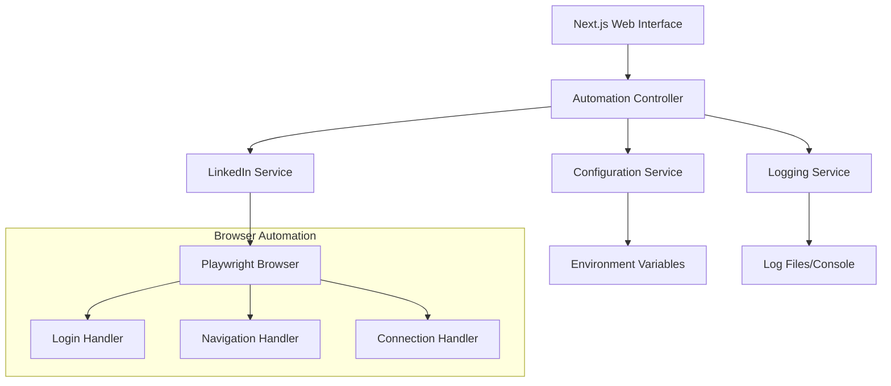

# Design Document

## Overview

The LinkedIn Connection Automation application is built using Next.js 14 with App Router for the web interface and Playwright for browser automation. The system follows a modular architecture with clear separation between the web UI, automation logic, and configuration management.

## Architecture



The application uses a service-oriented architecture where:

- **Web Interface**: Next.js app providing user control and status monitoring
- **Automation Controller**: Orchestrates the entire automation workflow
- **LinkedIn Service**: Handles all LinkedIn-specific interactions
- **Configuration Service**: Manages environment variables and settings
- **Logging Service**: Provides structured logging and monitoring

## Components and Interfaces

### 1. Web Interface Components

**AutomationDashboard**

- Displays current automation status
- Shows connection progress (current/max)
- Provides start/stop controls
- Real-time log display

**ConfigurationPanel**

- Environment variable validation
- Settings overview (without exposing sensitive data)
- Connection threshold configuration

### 2. Core Services

**AutomationController**

```typescript
interface AutomationController {
  start(): Promise<void>;
  stop(): Promise<void>;
  getStatus(): AutomationStatus;
  onStatusChange(callback: (status: AutomationStatus) => void): void;
}
```

**LinkedInService**

```typescript
interface LinkedInService {
  login(username: string, password: string): Promise<boolean>;
  navigateToNetworkGrowth(): Promise<void>;
  openConnectionModal(): Promise<void>;
  findEligibleConnections(minMutualConnections: number): Promise<Connection[]>;
  connectWithPerson(connection: Connection): Promise<boolean>;
}
```

**ConfigurationService**

```typescript
interface ConfigurationService {
  getLinkedInCredentials(): { username: string; password: string };
  getMinMutualConnections(): number;
  getMaxConnections(): number;
  validateConfiguration(): boolean;
}
```

### 3. Browser Automation Handlers

**LoginHandler**

- Handles navigation to LinkedIn home
- Manages sign-in process
- Validates successful authentication

**NavigationHandler**

- Manages page navigation
- Handles modal opening
- Waits for page elements to load

**ConnectionHandler**

- Parses connection cards
- Extracts mutual connection counts
- Performs connection actions

## Data Models

### Connection Model

```typescript
interface Connection {
  id: string;
  name: string;
  mutualConnectionsCount: number;
  profileUrl?: string;
  cardElement: ElementHandle;
}
```

### AutomationStatus Model

```typescript
interface AutomationStatus {
  isRunning: boolean;
  currentStep:
    | 'idle'
    | 'logging-in'
    | 'navigating'
    | 'processing-connections'
    | 'completed'
    | 'error';
  connectionsProcessed: number;
  connectionsSuccessful: number;
  maxConnections: number;
  lastError?: string;
  startTime?: Date;
  endTime?: Date;
}
```

### Configuration Model

```typescript
interface AppConfiguration {
  linkedinUsername: string;
  linkedinPassword: string;
  minMutualConnections: number;
  maxConnections: number;
  headless: boolean;
  timeout: number;
}
```

## Error Handling

### Browser Automation Errors

- **Login Failures**: Retry once, then fail with detailed error
- **Element Not Found**: Wait with timeout, log specific element selector
- **Network Issues**: Implement exponential backoff for retries
- **Rate Limiting**: Detect and pause automation with configurable delays

### Application Errors

- **Configuration Errors**: Validate on startup, provide clear error messages
- **Environment Variable Missing**: Fail fast with specific missing variable names
- **Playwright Browser Launch**: Fallback to different browser options

### Error Recovery Strategies

- **Graceful Degradation**: Continue processing remaining connections if individual failures occur
- **State Persistence**: Save progress to allow resuming after crashes
- **User Notification**: Real-time error reporting through web interface

## Testing Strategy

### Unit Testing

- **Service Layer**: Mock Playwright interactions, test business logic
- **Configuration**: Test environment variable parsing and validation
- **Data Models**: Test parsing of LinkedIn page elements

### Integration Testing

- **LinkedIn Service**: Test against LinkedIn test pages or mocked responses
- **Browser Automation**: Test with headless browser against static HTML
- **End-to-End Flow**: Test complete workflow with test LinkedIn account

### Test Data Management

- **Mock LinkedIn Pages**: Create static HTML files mimicking LinkedIn structure
- **Test Environment Variables**: Separate test configuration
- **Playwright Test Mode**: Use Playwright's test fixtures and mocking

### Performance Testing

- **Memory Usage**: Monitor browser memory consumption during long runs
- **Connection Speed**: Test automation timing and delays
- **Concurrent Limits**: Ensure single-instance execution

## Security Considerations

### Credential Management

- Environment variables for sensitive data
- No credential logging or exposure in UI
- Secure storage recommendations for production

### Rate Limiting Compliance

- Configurable delays between actions
- Respect LinkedIn's usage policies
- Implement circuit breaker pattern for repeated failures

### Browser Security

- Run in sandboxed environment
- Clear browser data after sessions
- Use incognito/private browsing mode

## Implementation Notes

### Playwright Configuration

- Use Chromium for consistency
- Configure user agent and viewport
- Enable request/response logging for debugging
- Set appropriate timeouts for LinkedIn's dynamic content

### Next.js Architecture

- App Router for modern React patterns
- Server Actions for automation control
- Real-time updates using Server-Sent Events or WebSockets
- API routes for status and configuration endpoints

### Development Workflow

- Environment-specific configurations
- Hot reload for UI development
- Playwright debug mode for automation development
- Structured logging for production monitoring
